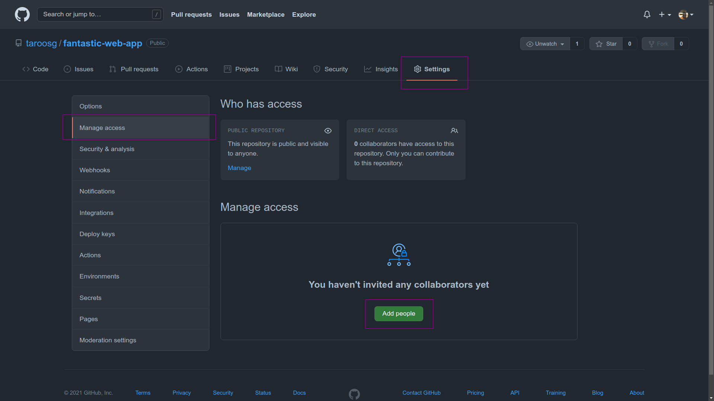
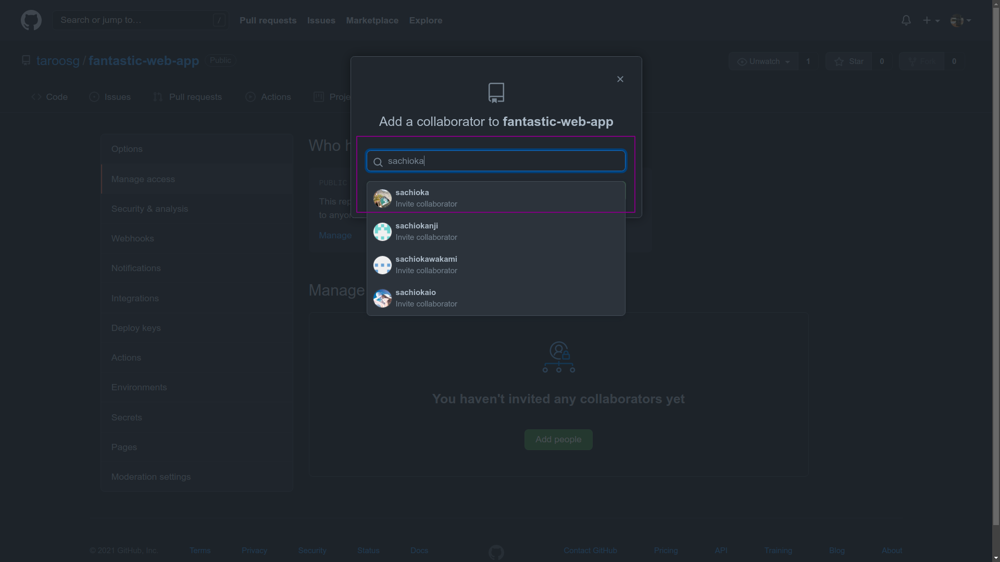
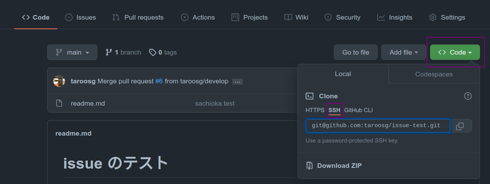

# GitHub を用いたシンプルなチーム開発

チーム開発を行う上で，ソースコードの管理・共有は非常に重要である．

手動での管理は非常に煩雑となるため，GitHub を用いて各メンバーが書いたソースコードを管理するのがオススメである．

本項では，最もシンプルな複数人での開発方法を紹介する．

## 開発の流れ

1. 【事前準備】リポジトリの作成．
2. 【事前準備】共同開発アカウントの追加．
3. 【事前準備】ソースコードの push（リーダー）．
4. 【事前準備】ソースコードのダウンロード（リーダー以外）．
5. 【実装時】作業内容を push（全員）．
6. 【実装時】最新のコードを手元に反映（全員）．

## 事前準備の流れ

複数人で開発する場合には事前準備が必要．

### リポジトリの作成．

リーダーは GitHub 上にプロダクト用のリポジトリを作成する．個人開発の場合と特に変わりなし．

### 共同開発アカウントの追加．

作成したリポジトリを全員で利用できるよう，リポジトリに他のメンバーのアカウントを追加する．

GitHub のリポジトリのページから，「Settings」→「Manage access」→「Add people」の順にクリックする．



検索ボックスにチームメンバーのアカウント名を入力すると候補がでてくるので追加する．



### ソースコードの push（リーダー）．

リーダーは GitHub 上のリポジトリにソースコードを push する．個人開発の場合と同様．

※何らかのソースコードがあれば良いので，空の HTML ファイルのみでも問題ない．

### ソースコードのダウンロード（リーダー以外）．

他のメンバーは GitHub 上のソースコードを `clone` して手元にダウンロードする．

リポジトリのページから URL を確認し，`git clone`コマンドでソースコードをダウンロードする．



```bash
$ git clone git@github.com:taroosg/fantastic-web-app.git
```

## 実装時の流れ

実装時は以下 2 つの手順の繰り返しとなる．

### 作業内容を push（全員）．

各メンバーはそれぞれ開発を進め，ある程度作業が完了したら `add`，`commit` して `push` する．

手順は個人開発と同様．

> 💡**Point**
>
> push する前には pull して最新のコードを手元に反映させておく！
>
> push したら必ずチームメンバーに伝達する！

### 最新のコードを手元に反映（全員）．

「 push した以外のメンバー」は push されたコードを手元に反映させるため， `pull` する．

```bash
$ git pull origin main
```

コマンドを実行したら，

> 💡**Point**
>
> 誰かが push したら早めに pull して自分のコードに反映させておく．

## 進める上でのポイント

### 常に「GitHub 上のコード」が最新になるようにする．

- GitHub から pull すれば手元のコードを最新の状態にできるように！
- push する前には pull して最新の状態を反映させる！

### 同じファイルは複数人で弄らない．

- 同じファイルを弄るとどれが最新版なのかわからなくなる．
- ↑ の状態で push や pull すると「コンフリクト」が発生する．

### 人間同士でコミュニケーションを密にする．

- push したら伝える，pull したら伝える，などなど．
- 他の人担当のファイルは勝手に弄らず，修正依頼を投げたほうが無難．
