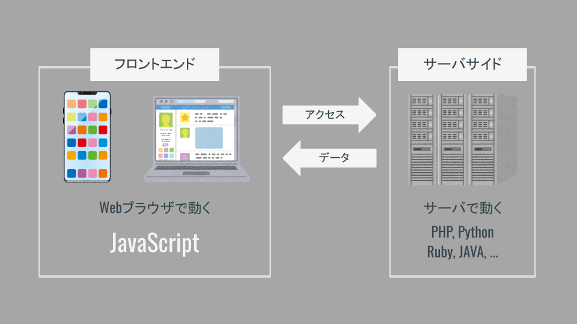

# JavaScript

### JavaScriptの役割

|言語|役割|
|-|-|
|HTML（マスター済み）|コンテンツの指定<br>タイトル，文章，画像などの記述|
|CSS（マスター済み）|コンテンツの装飾<br>色，大きさ，配置などの指定|
|JavaScript|ユーザー操作，イベント発生による動きを実現<br>（わりとなんでもできる）|

## JavaScriptとは

**JavaScript ≠ JAVA**

JavaScriptとJAVAの違い

|JavaScript|JAVA|
|-|-|
|フロントエンド言語|サーバサイド言語|
|カモミール|カモ|
|オーストラリア|オーストリア|
|ハムスター|ハム|
|メロンパン|メロン|


## Webアプリケーションに欠かせないJavaScript



### 言語別人気ランキング（2020年）

|言語|使用している開発者（%）|
|-|-|
|JavaScript|<code>&#124;&#124;&#124;&#124;&#124;&#124;&#124;&#124;&#124;&#124;&#124;&#124;&#124;&#124;&#124;&#124;&#124;&#124;&#124;&#124;&#124;&#124;&#124;&#124;&#124;&#124;&#124;&#124;&#124;&#124;&#124;&#124;&#124;&#124;&#124;&#124;&#124;&#124;&#124;&#124;&#124;&#124;&#124;&#124;&#124;&#124;&#124;&#124;&#124;&#124;&#124;&#124;&#124;&#124;&#124;&#124;&#124;&#124;&#124;&#124;&#124;&#124;&#124;&#124;&#124;&#124;&#124;&#124;&#124;&#124;</code>69.7%|
|HTML/CSS|<code>&#124;&#124;&#124;&#124;&#124;&#124;&#124;&#124;&#124;&#124;&#124;&#124;&#124;&#124;&#124;&#124;&#124;&#124;&#124;&#124;&#124;&#124;&#124;&#124;&#124;&#124;&#124;&#124;&#124;&#124;&#124;&#124;&#124;&#124;&#124;&#124;&#124;&#124;&#124;&#124;&#124;&#124;&#124;&#124;&#124;&#124;&#124;&#124;&#124;&#124;&#124;&#124;&#124;&#124;&#124;&#124;&#124;&#124;&#124;&#124;&#124;&#124;</code>62.4%|
|SQL|<code>&#124;&#124;&#124;&#124;&#124;&#124;&#124;&#124;&#124;&#124;&#124;&#124;&#124;&#124;&#124;&#124;&#124;&#124;&#124;&#124;&#124;&#124;&#124;&#124;&#124;&#124;&#124;&#124;&#124;&#124;&#124;&#124;&#124;&#124;&#124;&#124;&#124;&#124;&#124;&#124;&#124;&#124;&#124;&#124;&#124;&#124;&#124;&#124;&#124;&#124;&#124;&#124;&#124;&#124;&#124;&#124;&#124;</code>56.9%|
|Python|<code>&#124;&#124;&#124;&#124;&#124;&#124;&#124;&#124;&#124;&#124;&#124;&#124;&#124;&#124;&#124;&#124;&#124;&#124;&#124;&#124;&#124;&#124;&#124;&#124;&#124;&#124;&#124;&#124;&#124;&#124;&#124;&#124;&#124;&#124;&#124;&#124;&#124;&#124;&#124;&#124;&#124;&#124;</code>41.6%|
|JAVA|<code>&#124;&#124;&#124;&#124;&#124;&#124;&#124;&#124;&#124;&#124;&#124;&#124;&#124;&#124;&#124;&#124;&#124;&#124;&#124;&#124;&#124;&#124;&#124;&#124;&#124;&#124;&#124;&#124;&#124;&#124;&#124;&#124;&#124;&#124;&#124;&#124;&#124;&#124;</code>38.4%|
|C#|<code>&#124;&#124;&#124;&#124;&#124;&#124;&#124;&#124;&#124;&#124;&#124;&#124;&#124;&#124;&#124;&#124;&#124;&#124;&#124;&#124;&#124;&#124;&#124;&#124;&#124;&#124;&#124;&#124;&#124;&#124;&#124;&#124;</code>32.3%|
|TypeScript|<code>&#124;&#124;&#124;&#124;&#124;&#124;&#124;&#124;&#124;&#124;&#124;&#124;&#124;&#124;&#124;&#124;&#124;&#124;&#124;&#124;&#124;&#124;&#124;&#124;&#124;&#124;&#124;&#124;</code>28.3%|
|PHP|<code>&#124;&#124;&#124;&#124;&#124;&#124;&#124;&#124;&#124;&#124;&#124;&#124;&#124;&#124;&#124;&#124;&#124;&#124;&#124;&#124;&#124;&#124;&#124;&#124;&#124;&#124;</code>25.8%|

[ソース: https://insights.stackoverflow.com/survey/2020/#technology-programming-scripting-and-markup-languages](https://insights.stackoverflow.com/survey/2020/#technology-programming-scripting-and-markup-languages)


## JavaScript周辺の技術


### よく使われる技術

|技術|特徴|
|-|-|
||- JavaScriptのライブラリ．<br>- ユーザ操作イベントやアニメーションを実現<br>- ✅ 生JSと比較して短くかける．<br>- ✅ webアプリケーションで広く普及している．<br>- ✅ 導入が簡単．<br>- ✅ 学習コストが低い．<br>- 🔼 難しいことをやろうとすると複雑になる．<br>- まずはここから！|
|<br><br>|- JavaScriptのライブラリ．<br>- ✅ モダンなwebアプリケーション（SPA）を実現<br>- ✅ 高速！<br>- ✅ TypeScriptでの実装も可能<br>- ✅ スマホアプリも見据えた開発が可能．<br>- 🔼 学習コスト<br>- 🔼 環境構築がややハードル．<br>- （私はReactが好き）|
||- サーバサイドでJavaScriptを動かす技術．<br>- ✅ フロントもサーバもJavaScriptで書ける．．！<br>- ✅ サーバサイドの中では環境構築が容易<br>- 🔼 難しいことをやろうとすると複雑になる．|

## JavaScriptを書く

### 書き方
`<script></script>`の間に処理を記述！

### 書く場所

- htmlファイルの`</body>`のすぐ上に書こう！
- ほかにもいくつか書ける場所があります．
- 別にファイルを作るやり方もあります．

### まず動かす！！

- `alert()`
- `console.log()`

>文字列は「`'`」か「`"`」で囲む．どちらでもOK！

```html
<script>
  alert('Hello world');

  console.log('Hello world');

</script>

```
