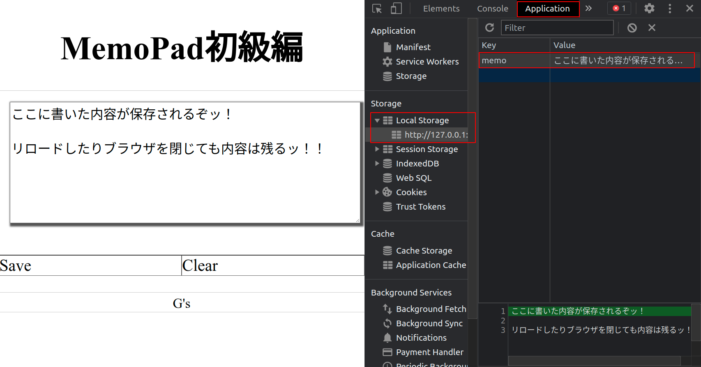

# LocalStorage（メモ帳初級）

## LocalStorage とは

### 変数やオブジェクトの問題

- ブラウザをリロードすると初期化される．
- 次回読み込んだときまで値を保存したいときにつらい！

### LocalStorage ができること

- ブラウザにデータを保存できる！
  - テキスト形式のデータのみ．
- 「オリジン単位」ごとに 5MB まで保存できる．
- （自分で削除しないと永続的に保存される）

> オリジン単位とは「http://www.example.com:80」のような「プロトコル://ドメイン名:ポート番号」のこと．
>
> [参考: https://gihyo.jp/dev/serial/01/javascript-security/0004?page=2](https://gihyo.jp/dev/serial/01/javascript-security/0004?page=2)

## 本日実装するアプリケーション

### メモ帳をつくろう！

- ブラウザ上のテキストエリアにメモを入力．
- ブラウザに情報を保存．
- リロードしても情報が保存されるようにする．

### 仕様

- save ボタンをクリックしたら情報を保存．
- clear ボタンをクリックしたら情報を削除．
- リロード時に情報が保存されていれば自動的に表示．

### 完成イメージ

LocalStorage の内容は検証画面から確認できる．

「Application」 -> 「LocalStorage」の順にクリックすると確認できる（下図の赤枠部分）．



## LocalStorage の使い方

### しくみ

「key」と「value」の形式でデータを保存する．key 名を変えれば複数保存できるッ！

| key    | value                                            |
| ------ | ------------------------------------------------ |
| memo01 | コード！書かずにはいられないッ！                 |
| memo02 | 最終的に．．．動けばよかろうなのだァァァァッ！！ |
| memo03 | 過程や！方法なぞ！どうでもよいのだァーッ         |

### JavaScript での扱い方

今回はデータの登録（すでに同じ key が存在する場合は上書き）とデータの取得を扱う．

| 内容         | JavaScript の書き方                 |
| ------------ | ----------------------------------- |
| データ登録   | `localStorage.setItem(key, value);` |
| データ取得   | `localStorage.getItem(key);`        |
| データ更新   | `localStorage.setItem(key, value);` |
| データ削除   | `localStorage.removeItem(key);`     |
| データ全削除 | `localStorage.clear();`             |
| データの長さ | `localStorage.length;`              |
| データの順番 | `localStorage.key(インデックス);`   |

## メモ帳に必要な処理

### 1. データを保存するときの処理

1. save ボタンのクリックでイベント発火．
2. テキストエリアの情報を取得．
3. LocalStorage に情報を保存．

### 2. データを削除するときの処理

1. clear ボタンクリックでイベント発火．
2. LocalStorage の情報を消去．
3. 画面上の入力欄をクリア．

### 3. データを取得するときの処理

1. 読み込み時に LocalStorage のデータ有無を確認．
2. 保存されていれば情報を取得．
3. テキストエリアに情報を表示．

## データを保存するときの処理

1. save ボタンのクリックでイベント発火．
2. `.val()`でテキストエリアの情報を取得．
3. `localStorage.setItem()`で LocalStorage に情報を保存．

```js
// memo01.html

$("#save").on("click", function () {
  const text = $("#text_area").val();
  localStorage.setItem("memo", text);
});
```

### 💡 Key Point

> 「localStorage」は手打ちせず補完に頼る！！

## データを削除するときの処理

1. clear ボタンクリックでイベント発火．
2. key 名を指定して LocalStorage の情報を消去．
3. 画面上の入力欄をクリア（空文字で上書きする）．

```js
// memo01.html

$("#clear").on("click", function () {
  localStorage.removeItem("memo");
  $("#text_area").val("");
});
```

> 「`.val()`」は`()`内に何か入れると入れた値で上書きする！

## データを取得するときの処理

1. 読み込み時に条件分岐を用いて LocalStorage のデータ有無を確認．
2. 保存されていれば情報を取得．
3. テキストエリアに情報を表示．

```js
// memo01.html

if (localStorage.getItem("memo")) {
  const text = localStorage.getItem("memo");
  $("#text_area").val(text);
}
```

> データがないのに処理しようとするとエラーになってしまう．データがないときは何もしない．

## 練習

`memo01.html`に以下の処理を順番に実装しよう．

1. save ボタンクリック時にデータの保存
2. clear ボタンクリック時にデータの消去
3. 読み込み時にデータの取得

LocalStorage の中身は検証画面から確認しよう．それぞれ以下の状態になれば OK！

- 保存時にデータが保存され，検証画面から確認できる．
- 消去時に保存してあるデータが消去される．
- リロード時に保存しているデータがあれば画面に表示される．
