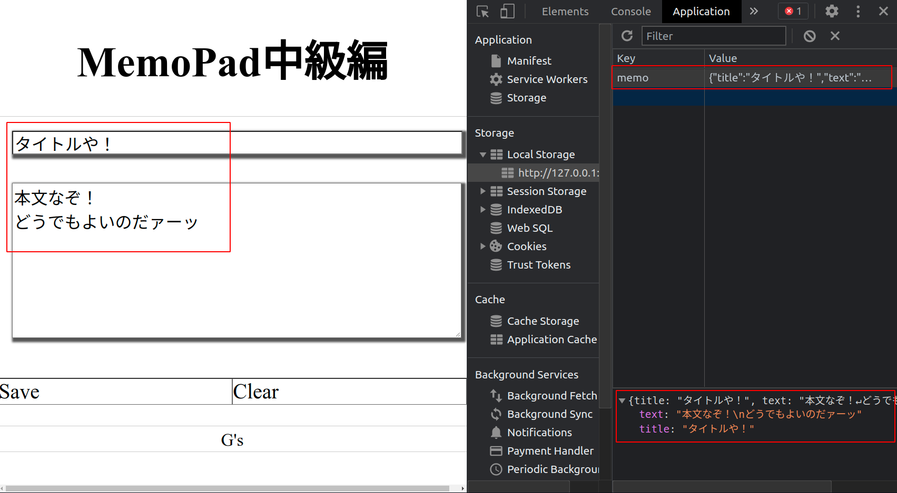

# JSONデータ（メモ帳中級）


## メモ帳初級の問題点

データが1件しか保存できない．複数のメモを個別に残しておきたいときに困る．

## 複数件のデータを管理する

配列かオブジェクトを使えば複数件のデータをまとめることができる．これを用いればメモ欄が複数になっても管理できそうである．


## だめです

配列やオブジェクトは言語毎に形式が異なるため互換性がない（JavaScriptの配列はJavaScriptでしか扱えない）．

つまり，LocalStorageも配列やオブジェクトを保存することはできない．


## 互換性のあるデータであるJSON形式

Webアプリケーションは複数の言語で構成されていることが多い．このような場合にお互いのデータをやり取りするため，互換性のある「JSON形式」が準備されている．

各言語では「自前の配列やオブジェクト」と「JSON形式のデータ」を相互に変換する処理が準備されている．


## メモ帳中級編のイメージ

タイトルと本文をまとめて保存できるようにする！




## JSONの扱い方

JavaScriptには（他の言語でも）「配列やオブジェクトをJSONに変換する処理」と「JSONを配列やオブジェクトに戻す処理」が用意されている．

### 配列やオブジェクトをJSONに変換する処理

`JSON.stringify()`でJSON形式に変換できる．

```js
const data = {
  title: '波紋の使い方',
  text: 'メメタァ'
};

const jsonData = JSON.stringify(data);
localStorage.setItem('memo', jsonData);

```

### JSONを配列やオブジェクトに戻す処理

`JSON.parse()`でJSON形式から戻すことができる．

```js
const jsonData = localStorage.getItem('memo');
const data = JSON.parse(jsonData);
console.log(data)

```

## 練習

タイトルと本文の両方を保存できるメモ帳を実装しよう．

- 動き方はメモ帳初級編と同様
- saveボタンクリック時に
    - タイトルと本文の値を取得してまとめる．
    - まとめたデータをJSON形式に変換する．
    - JSON形式のデータをLocalStorageに保存．
- clearボタンクリック時にデータを消去
- 読み込み時に
    - LocalStorageからJSON形式のデータを取得する．
    - JSON形式のデータをオブジェクトに戻す．
    - オブジェクトからデータを取り出して画面に表示する．

