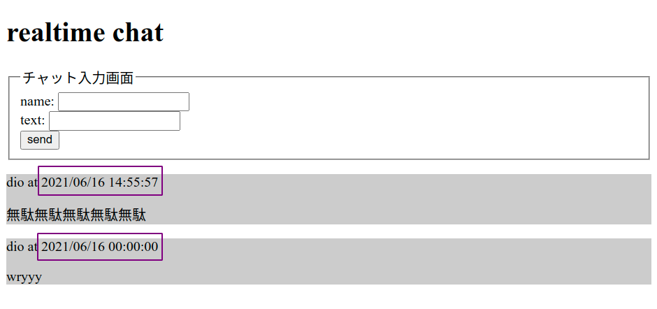

# 機能追加

データの取得と表示（データ送信と同時に画面更新）は実装ができたが，下記の問題点がある．

- 時刻がわかりにくい．
- 最新がどれなのかわかりにくい．

これらを解決するために以下の処理を実装していく．

## 時刻データの表示形式変更

JavaScriptにおいて時刻処理は非常に煩雑である．時刻関連の処理を実装するためにはライブラリを使用したほうが実装の負荷が少なくバグも少ない．

### 時刻変換関数

今回はサンプルコード内に時刻の形式を変換する関数（下記）を記述しておいたため，これを利用する．解説は省略．

```js
// chatapp.html内に記述してある関数

function convertTimestampToDatetime(timestamp) {
  const _d = timestamp ? new Date(timestamp * 1000) : new Date();
  const Y = _d.getFullYear();
  const m = (_d.getMonth() + 1).toString().padStart(2, '0');
  const d = _d.getDate().toString().padStart(2, '0');
  const H = _d.getHours().toString().padStart(2, '0');
  const i = _d.getMinutes().toString().padStart(2, '0');
  const s = _d.getSeconds().toString().padStart(2, '0');
  return `${Y}/${m}/${d} ${H}:${i}:${s}`;
}

```

### 関数を利用

本関数を利用して，タグ生成部分の処理で時刻形式を変換する．

```js
// chatapp.html

const tagArray = [];
dataArray.forEach(function (data) {
  tagArray.push(`
    <div id="${data.id}">
      <p>${data.data.name} at ${convertTimestampToDatetime(data.data.time.seconds)}</p>
      <p>${data.data.text}</p>
    </div>
  `);
});

```

### 動作確認

下記のように人間が認識しやすい形式になって表示される．




## データの並び替え

本アプリケーションはチャット機能がメインであるため，送信日時が新しいメッセージが上部に表示されることが望ましい．

しかし，初期状態ではFirestore上のID名順でデータを取得しているため，`time`でソートされた状態でデータを取得できるようにしたい．

- データのソートには`.orderBy()`を利用する．
- `.orderBy()`には2つのデータを入力する．1つ目は「どの項目で並び替えをするか」2つ目は「昇順（`asc`）か降順（`desc`）」である．

データ取得時の処理に追記する．

```js
// chatapp.html

db.orderBy('time', 'desc').onSnapshot(function (querySnapshot) {
  // 省略
});

```

ブラウザで並び順が変更されているか確認しよう．


## 【おまけ】Enterキーで送信

ボタンクリックではなく，メッセージ入力時にEnterキーを押して送信することもできる．

この場合，イベント情報から「入力したキーを識別するキーコード」を抽出してキーを判別する．

- `function (e)`の`e`にイベント情報（この場合`keydown`）で取得可能なデータが格納される．
- `e.keyCode`でどのキーを押したかが識別可能であるため，Enterのキーコードを調べておけば条件分岐でデータ送信を行える．

```js
// chatapp.html

$('#text').on('keydown', function (e) {
  if (e.keyCode === 13) {
    const data = {
      name: $('#name').val(),
      text: $('#text').val(),
      time: firebase.firestore.FieldValue.serverTimestamp(),
    };
    db.add(data);
    $('#text').val('');
  }
});

```

このように，JavaScriptではイベントに関連した情報を取得することができる．これらを用いて画面の特定の部分をクリックしたときだけ発火させたり，決まった順にタイプしたときだけ発火させたりできる．
