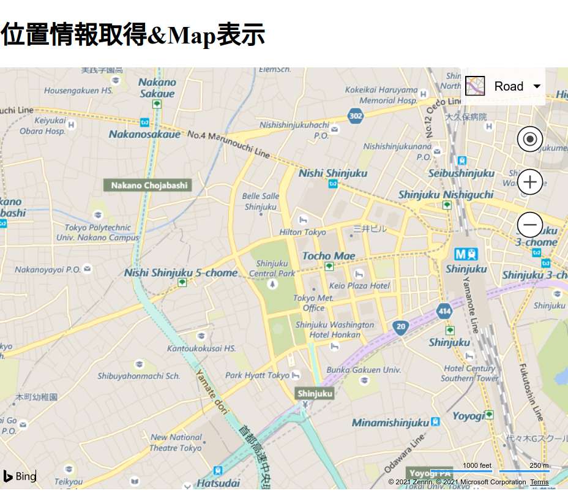

# BingMapsAPI/実践

コードの読み込み

```html
<script src='https://www.bing.com/api/maps/mapcontrol?mkt=ja-jp&key=API_KEY'></script>
<script>
  // jsの処理
</script>
```

処理の流れ

位置情報の取得
navigator.geolocation…
成功時の関数，失敗時の関数，オプションは先程と同様．
（成功時の関数にマップ表示の処理を追加する）
マップの表示
ブラウザに地図を表示する．
中心座標の指定が必要．
（取得した緯度と経度を使用する）


準備

```js
// マップ表示に使用する変数を用意しておく．
// 失敗時の関数とオプションをコピーペーストしておく
// （エラー時の警告とオプション内容は位置情報取得の処理と同様のため）

let map;

const option = {...};

function showError(error) {...}


```

```js
// 位置情報取得に成功したときの関数（mapsInit）を定義する．
// 「地図を表示したいHTML要素のid」「center」「zoom」を指定する．

function mapsInit(position) {
  const lat = position.coords.latitude;
  const lng = position.coords.longitude;
  map = new Microsoft.Maps.Map('#map', {
    center: {
      latitude: lat, longitude: lng
    },
    zoom: 15,
  });
}
```

```js
// 外部ファイルの読み込みがあるため，読み込み終了後に実行するよう指定する．
// 他のファイルの読み込みが終わったら{}内を実行する
// 現在地を取得し，成功したら地図を表示する関数を実行する
window.onload = function () {
  navigator.geolocation.getCurrentPosition(mapsInit, showError, option);
}


// 【Point】
// 読み込み → 位置情報取得 → マップ表示 の順番

```

結果



練習

下記の処理を実装しよう！
位置情報の取得に成功したときに関数を定義し，map表示の処理を記述
位置情報を取得する処理

