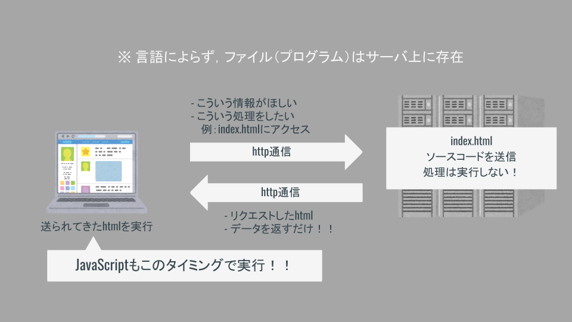

# PHP 概要

## Web アプリケーションの仕組み（動き方）

Web アプリケーション（のソースコード）は世界のどこかにある「サーバ」に置かれている．


Web アプリケーションを使用するときは，Web ブラウザに「URL」を指定する．

- Web ブラウザから「http」方式で URL に「リクエスト」を送る．
- URL は Web 上にたくさんあるファイルを必ず 1 つ指定できるようになっている（ユニークな文字列）．

URL の構造は下記のようになっている．

```txt
https://www.emperor-crimson.com/data/status.php
  ^       ^                      ^      ^
  |       |                      |      |
scheme hostname（サーバ名）    directory filename
```

## サーバ - クライアント型のアプリケーション

### サーバで動作する言語（サーバサイド）

サーバ上でプログラムが実行される．


- PHP
- Ruby
- Python
- JAVA
- Node.js
- etc...

### クライアント（web ブラウザ）で動作する言語（クライアントサイド）



web ブラウザがプログラムを実行する．

- HTML
- CSS
- JavaScript

## サーバサイドの役割

様々な Web アプリケーションが存在するが，基本のサーバサイド処理は同様である．

基本の機能は何らかのデータを扱うことである．

### 例

- twitter => ツイート，検索，タイムラインの表示，etc
- facebook => 投稿，検索，記事の更新，コメント，etc
- wordpress => ブログ記事の投稿，編集，削除，etc

※：アプリケーションは必ずしも PHP で作られているわけではない！！

### 💡 Key Point

> 上記の処理は以下の 4 つに集約される．
>
> - 📝 データの「作成」（Create）
> - 📖 データの「参照」（Read）
> - 🔄 データの「更新」（Update）
> - 🗑 データの「削除」（Delete）

これら 4 種類の処理の頭文字をとって「CRUD」と呼ぶ．
