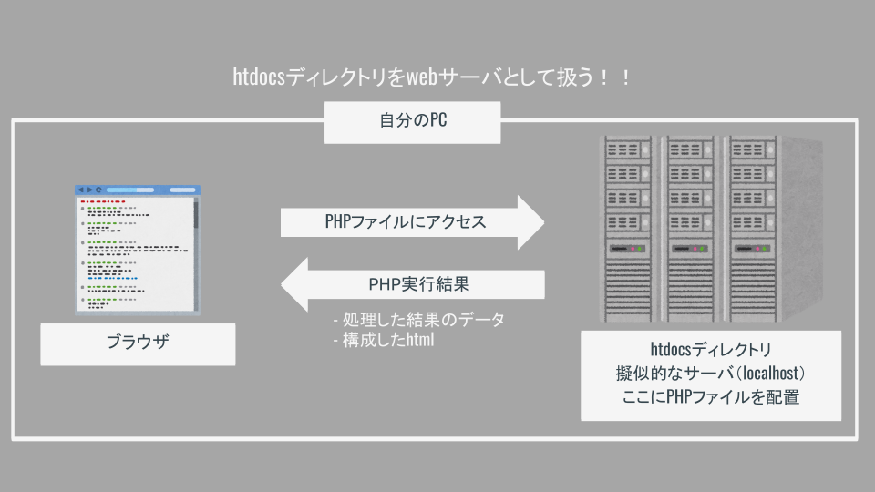

# PHP 基礎

## サーバサイド言語での開発

PHP（及び他のサーバサイド言語）を動作させるには「サーバ」が必要となる．

しかし，自身の PC で開発を行う場合に都度サーバを用意することは効率的ではない．

このような場合に自身の PC 内で擬似的なサーバを用意して PHP を動作させることができるのが「xampp」である．

xampp は以下の役割を提供する．

- PHP を動作させるアプリケーションサーバ（`Apatch web server`）を用意する．
- データを保存するためのデータベース（`MySQL Database`）を用意する．
- その他いろいろ（今回の開発では使用しない）．

## 開発の手順

xampp は PC 内に`localhost`というサーバを用意してくれる．

このサーバ内に PHP ファイルを配置することで PHP のコードを動かすことができる．

PC 内では予め指定されたディレクトリ（`htdocs`）がサーバの役割をするよう決められているため，まず PHP ファイルを指定のディレクトリに配置する作業が必要となる．

サンプルフォルダを下記のディレクトリへ移動すると PHP を動かせる！

- windows : `C\xampp\htdocs\`
- mac : `/Applications/xampp/xamppfiles/htdocs/`

## 便利な設定

- `htdocs`はよく使うのでショートカットを用意しておくと便利！！
- `htdocs`内に講義用のフォルダを用意しておくと管理しやすい！
- `htdocs`内の`index.php`の名前を`index.php.old`に変更しておくとブラウザ画面から`htdocs`内のファイルが確認できて便利！！

### 💡 Key Point

> **【重要】開発の手順は以下の流れとなる．**
>
> 1.  xampp を起動する
> 2.  php ファイルが入ったフォルダを htdocs に配置
> 3.  vs code で htdocs の上記フォルダを開く
> 4.  php のコードを書く
> 5.  ブラウザで localhost にアクセスして動作確認
>
> 以降，3-5 の繰り返し！
>
> ※一通り終わったら xampp を終了させることを推奨（次回起動でコケる）
