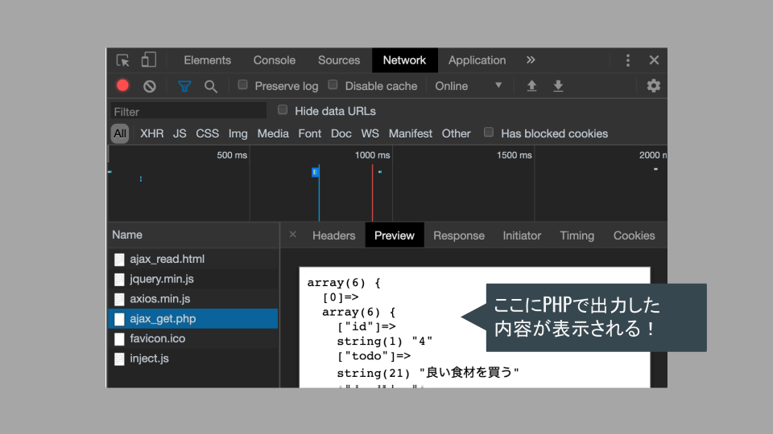

# Ajax実装

DBへの登録，表示などの処理を実行するPHPファイルとのhttp通信を
JavaScriptで
扱う手法ッ！！


メリット
データだけをやり取りするので速い&通信量が少ない！
ファイル数が少なくできる&フロントとサーバの分業がしやすい！
通信時にリロードがない！ <- 無限スクロールなどで活用される
デメリット
SEOに弱い（最近は大丈夫になってきている）
構造が複雑になりがち．
ページを更新すると表示内容が初期状態に戻る．


|方法|特徴|
|-|-|
|XMLHttpRequest|生JS / 一番昔から存在する|
|$.ajax()|jQuery / これが出てきて流行った|
|fetch|生JS / 慣れないと分かりづらい|
|axios|ReactとかVueでも使われていて使い勝手が良い|

Ajaxを使ってリアルタイム検索を実装！！
検索ボックスになにか入力したら，該当するデータだけをDBから取り出して表示
検索ボタンではなく，入力した時点でリアルタイムに検索する．
※JavaScriptとPHPが入り乱れるので都度ファイル名を確認！！！


必要なもの
JavaSciptのコード（ajax_search.html）
PHPファイルに対してリクエストを送る処理．
APIへのリクエストと同じくaxios.get()を使用． <- やっていることは同じ
PHPのコード（ajax_get.php）
DBからデータを取得する処理．
前回までのtodo_read.phpとほぼ同様．
取得したデータをJSON形式で返す．
「API」をPHPでつくる！！！

処理の流れ
JavaScriptからPHPファイルにリクエスト（検索ワード）を送る．（JS）
DBからデータを取得する．（PHP）
取得したデータをJSON形式にして出力する．（PHP）
JavaScriptでデータを受け取る．（JS）<- 今回はここまでつくろう！
（受け取ったデータをブラウザに表示）

```js
// ajax_search.html
// phpへリクエストを送って結果を出力する処理

検索フォーム：<input type="text" id="search">
// ...
$('#search').on('keyup', function (e) {
  console.log(e.target.value);			// inputの内容をリアルタイムに取得
  const searchWord = e.target.value;
  const requestUrl = 'ajax_get.php';	// リクエスト送信先のファイル
  // ...続く
});
```

```js
// phpへリクエストを送って結果を出力する処理
axios.get(`${requestUrl}?searchword=${searchWord}`)	// リクエスト送信
  .then(function (response) {
    console.log(response);		// responseにPHPから送られたデータが入る
	// 今回はconsoleでデータが出てくればOK．
    // できる人はここにブラウザに表示する処理を書こう！
  })
  .catch(function (error) {...})
  .finally(function () {...});
```

```php
// ajax_get.php
// 関数ファイル読み込み処理を記述（認証関連は省略でOK）
// DB接続の処理を記述
$search_word = $_GET["searchword"];	// GETのデータ受け取り
$sql = "SELECT * FROM todo_table  WHERE todo LIKE :search_word";
// 省略
$stmt->bindValue(':search_word', "%{$search_word}%", PDO::PARAM_STR);
// 省略
if ($status == false) {
  // エラー処理を記述
} else {
  $result = $stmt->fetchAll(PDO::FETCH_ASSOC);
  echo json_encode($result);		// JSON形式にして出力
  exit();
}

```



リアルタイム検索を実装しよう！
axios.get()でリクエストを送ろう！（ajax_read.html）
DBからデータを取得しよう！（ajax_get.php）
JSON形式にして出力しよう！（ajax_get.php）
受け取ってconsoleでデータを確認しよう！（ajax_read.html）
（できる人はブラウザにデータを表示しよう！）

